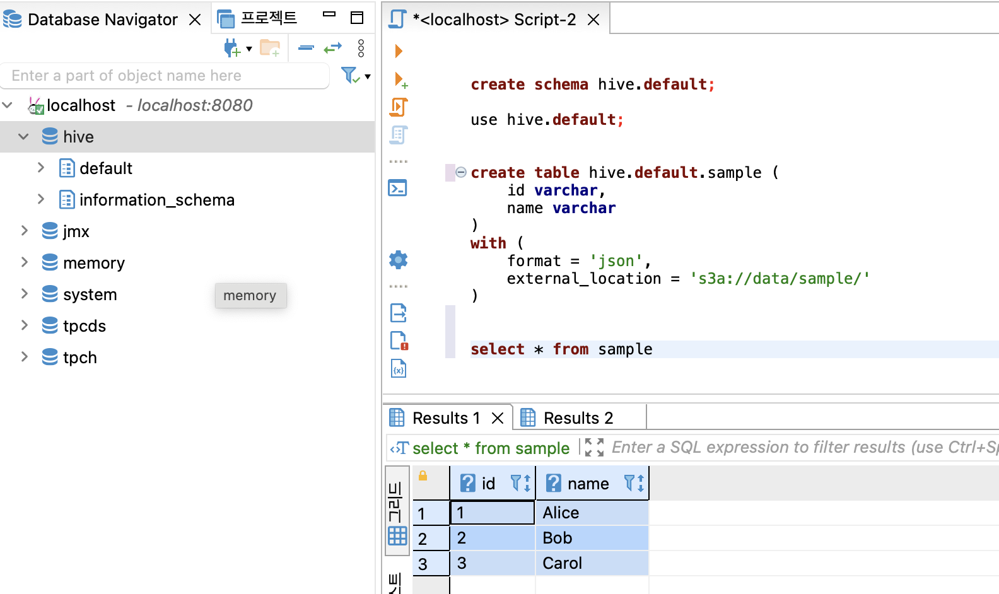

## trino(presto), minio docker 테스트 환경 

### Run, Initialize

```sh
$ docker-compose up -d
Creating network "trino_default" with the default driver
Creating minio ... done
Creating trino ... done

# create catalog, data directory 
$ rclone --config local.conf mkdir local:catalog
$ rclone --config local.conf mkdir local:data
```

### Test 

```sh
cat 1.json
{"id":1,"name":"Alice"}
{"id":2,"name":"Bob"}
{"id":3,"name":"Carol"}

# test data copy
$ rclone --config local.conf copy 1.json local:data/sample/
```

> dbeaver 같은 툴로 trino 연결 

```sql
-- hive 의 schema(db) 생성 
create schema hive.default;

-- table 생성 
create table hive.default.sample (
  id varchar,
  name varchar
)
with (
  format = 'json',
  external_location = 's3a://data/sample/'
);


-- select 
select * from sample;
```

